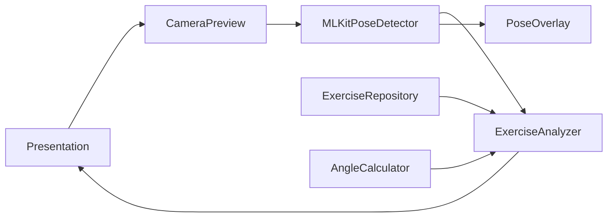

# Virtual Fitness Coach Android 项目介绍（技术版）

> 受众：Android 开发、算法工程、测试与架构评审人员
> 
> 目标：快速理解系统分层、核心链路、实现原理与可演进方向

## 1. 项目定位与技术边界

- 项目类型：单模块 Android App（`app`）
- 核心能力：基于 CameraX + ML Kit Pose Detection 的实时姿态识别与动作评分
- 当前动作：深蹲、俯卧撑、平板支撑
- 当前计数：深蹲与俯卧撑（平板支撑暂以姿态评分为主）

## 2. 技术栈与工程配置

- 语言与 UI：Kotlin + Jetpack Compose + Material 3
- 架构风格：分层目录（`data/domain/presentation/utils`）
- DI：Hilt（`@HiltAndroidApp`、`@AndroidEntryPoint`）
- 视觉链路：CameraX + Google ML Kit Pose Detection
- 构建：AGP `8.13.0`、Kotlin `2.2.20`、`minSdk=24`、`targetSdk=36`

关键配置文件：

- `settings.gradle.kts`
- `build.gradle.kts`
- `app/build.gradle.kts`
- `gradle/libs.versions.toml`
- `app/src/main/AndroidManifest.xml`

## 3. 代码分层与核心职责

### 3.1 Presentation 层

- 导航：`app/src/main/java/cn/skstudio/fitness/presentation/navigation/FitnessNavigation.kt`
- 页面：`ExerciseListScreen`、`ExerciseDetailScreen`、`ExerciseScreen`
- 相机与绘制：`CameraPreview`、`PoseOverlay`
- 责任：权限申请、实时画面展示、反馈 UI、状态绑定

### 3.2 Domain 层

- 模型：`Exercise`、`StandardPose`、`AngleRequirement`、`PosePoint`
- 接口：`PoseDetector`
- 用例：`ExerciseAnalyzer`
- 工具：`AngleCalculator`
- 责任：业务规则表达、角度评分、重复计数状态机

### 3.3 Data 层

- 规则数据源：`ExerciseRepository`
- 检测实现：`MLKitPoseDetector`
- 责任：动作规则提供、关键点检测与数据转换

## 4. 核心运行链路

1. `MainActivity` 挂载 `FitnessNavigation`
2. 用户进入 `ExerciseScreen` 并授予相机权限
3. `CameraPreview` 使用 CameraX 建立预览 + `ImageAnalysis`
4. 每帧送入 `MLKitPoseDetector.processImageProxy()`
5. 输出 `List<PosePoint>` 到 `Flow`
6. `ExerciseAnalyzer.analyzePose()` 执行评分 + 反馈 + 计数
7. `PoseOverlay` 绘制骨架，UI 显示状态、分数和指导文案

## 5. 关键实现原理

### 5.1 姿态检测

- 输入：`ImageProxy` -> `InputImage`
- 引擎：ML Kit（快速/高精模式）
- 输出：`PoseLandmark` 映射为 `PosePoint`
- 归一化：坐标缩放到 `0~1`，适配不同分辨率

### 5.2 动作评分

- 将关键点构建为 `poseMap`
- 针对每个 `StandardPose` 逐关节计算角度
- 按角度区间偏差计算分值，姿态得分取平均
- 帧总分取多个标准姿态中的最佳匹配分

### 5.3 重复计数

- 采用阈值状态机：起始阈值、下位阈值、上位阈值、冷却时间
- 基于 `repInProgress`、`repReachedDown`、`repFormValid` 判定有效性
- 输出 `RepetitionMetrics`（总数/有效/无效/时长）

### 5.4 可视化反馈

- `PoseOverlay` 绘制关键点和骨架连接
- 按置信度分级着色（绿/黄/红）
- 支持前置镜像显示，保持用户观察一致性

## 6. 系统结构图

## 7. 已知边界与技术债

- `checkCommonMistakes()` 当前为空实现
- 大量对象在 Composable 内 `remember { ... }` 实例化，DI 一致性可提升
- 自动化测试仍是模板，算法和状态机覆盖不足
- 部分业务文案未完全资源化（`strings.xml`）

## 8. 推荐演进路线

1. 先补 `ExerciseAnalyzer` 单测（阈值边界、计数状态机、异常姿态）
2. 用 ViewModel + Hilt 统一状态和依赖注入
3. 落地 `checkCommonMistakes()` 可解释规则
4. 文案资源化与多语言统一
5. 按需评估 TFLite 模型接入，形成规则+模型混合识别

## 9. 快速索引

- 入口：`app/src/main/java/cn/skstudio/fitness/MainActivity.kt`
- 导航：`app/src/main/java/cn/skstudio/fitness/presentation/navigation/FitnessNavigation.kt`
- 检测：`app/src/main/java/cn/skstudio/fitness/data/repository/MLKitPoseDetector.kt`
- 分析：`app/src/main/java/cn/skstudio/fitness/domain/usecase/ExerciseAnalyzer.kt`
- 角度工具：`app/src/main/java/cn/skstudio/fitness/utils/AngleCalculator.kt`
- 训练页：`app/src/main/java/cn/skstudio/fitness/presentation/exercise/ExerciseScreen.kt`

