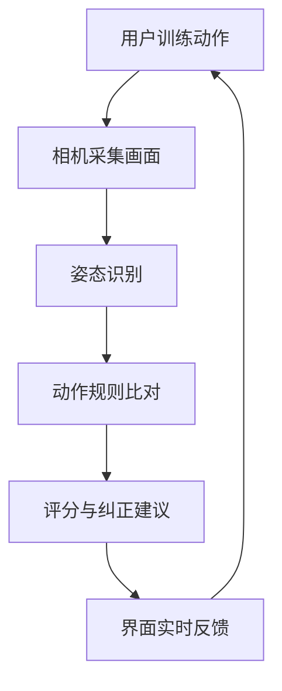

# Virtual Fitness Coach Android 项目介绍（非技术版）

> 受众：产品、运营、管理、合作方
> 
> 目标：用业务语言说明“这个项目做什么、怎么用、当前做到哪里、下一步往哪走”

## 1. 项目是什么

Virtual Fitness Coach 是一款手机端智能健身应用。用户打开摄像头后，系统会实时识别动作姿态，并给出分数、提示和训练反馈，帮助用户更安全、标准地完成训练。

## 2. 项目能解决什么问题

- 居家训练缺少实时指导，动作容易变形
- 新手难以判断动作是否标准
- 缺少即时纠偏，长期训练效果不稳定

本项目通过“实时识别 + 评分反馈”把训练过程从“盲练”变成“可观察、可纠正、可积累”。

## 3. 当前已实现的核心能力

1. **动作选择**：可选择深蹲、俯卧撑、平板支撑
2. **动作讲解**：每个动作都有说明、目标肌群、要点和常见错误
3. **实时识别**：训练时自动识别人体关键点并显示骨架
4. **即时反馈**：展示动作评分和纠正提示
5. **训练计数**：深蹲/俯卧撑支持总次数、有效次数、无效次数统计

## 4. 用户使用流程

1. 打开应用，选择动作
2. 查看动作详情和注意事项
3. 点击开始练习并授权相机
4. 按提示进入画面，系统开始实时分析
5. 根据评分和反馈调整动作
6. 结束后查看计数结果和训练表现

## 5. 系统工作方式（业务视角）

- 相机持续采集用户动作画面
- 系统识别人体关键部位位置
- 将用户姿态和“标准动作规则”做对比
- 产出分数、提示与计数
- 在屏幕上同步展示训练状态

## 6. 整体逻辑图

## 7. 当前项目边界

- 已覆盖 3 个常见基础动作
- 错误动作识别（如膝内扣、塌腰）还在完善中
- 训练历史与长期进度追踪尚未上线

## 8. 项目价值

- 对用户：降低入门门槛，提升训练安全性与动作标准度
- 对产品：形成可持续扩展的智能训练基础能力
- 对业务：具备拓展训练计划、会员服务、课程化内容的潜力

## 9. 后续规划（建议）

1. 扩充动作库（核心训练 + 拉伸 + 康复基础动作）
2. 增加训练历史与进步趋势分析
3. 增加个性化计划与分层指导
4. 增加语音提示与更细粒度纠错
5. 逐步引入模型能力，提升复杂场景识别稳定性

## 10. 对外沟通一句话版本

“这是一款通过手机摄像头实时识别健身动作、即时打分并给出纠正建议的智能健身教练应用。”

