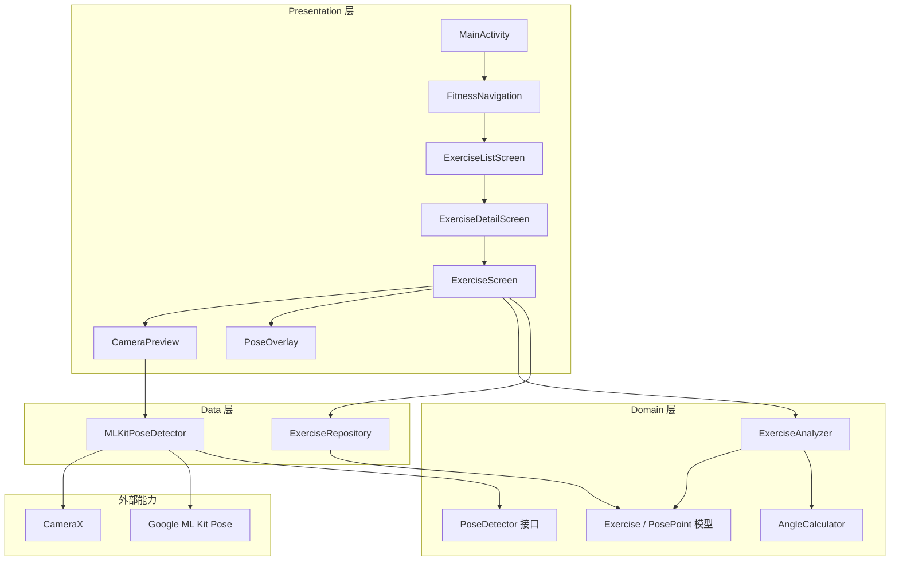
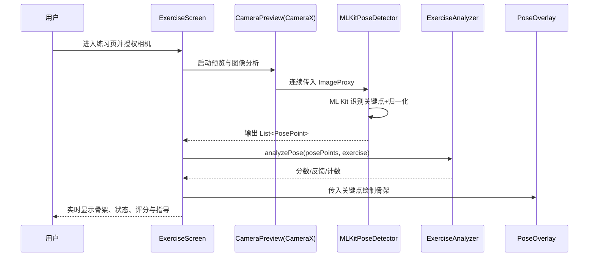

# Virtual Fitness Coach Android 项目整体分析与模块说明

> 文档导航：
> - 技术版：`doc/项目介绍-技术版.md`
> - 非技术版：`doc/项目介绍-非技术版.md`
> - 当前文档：综合版（结构、模块、原理、框图）

> 文档目的：从工程结构、功能模块、实现原理、系统框图四个维度，对当前项目做可落地的技术说明，便于新成员快速上手与后续维护。

## 1. 项目结构与文件/目录作用

### 1.1 根目录结构（工程级）

| 路径 | 作用 |
| --- | --- |
| `settings.gradle.kts` | Gradle 工程入口，声明根项目名与模块（当前仅 `:app`）。 |
| `build.gradle.kts` | 根构建脚本，集中声明 Android/Kotlin/Hilt 等插件别名。 |
| `gradle/libs.versions.toml` | 版本目录，统一管理 AGP、Kotlin、Compose、测试依赖版本。 |
| `gradle.properties` | Gradle 全局参数（JVM、构建优化等）。 |
| `gradlew` / `gradlew.bat` | 跨平台 Gradle Wrapper 启动脚本。 |
| `app/` | 应用主模块，业务代码与资源均在此。 |
| `doc/` | 项目文档目录（本文件所在目录）。 |
| `README.md` | 面向使用者的项目介绍与快速上手说明。 |
| `QUICK_START.md` / `DEBUG_GUIDE.md` | 快速启动与调试实践文档。 |
| `PROJECT_ANALYSIS.md` | 历史分析文档，包含风险点和关键链路摘要。 |
| `run.sh` / `run.bat` / `test_app.sh` / `test_app.bat` | 便捷运行与测试脚本。 |
| `ci_build.sh` | CI 构建脚本。 |
| `generate_icons_safe.sh` / `ICON_REPLACEMENT_GUIDE.md` | 应用图标生成和替换流程。 |
| `build/` | 构建输出目录（自动生成）。 |

### 1.2 `app` 模块结构（业务级）

| 路径 | 作用 |
| --- | --- |
| `app/build.gradle.kts` | App 模块构建配置：`compileSdk=36`、`minSdk=24`、Compose、CameraX、ML Kit、Hilt 等依赖。 |
| `app/src/main/AndroidManifest.xml` | 权限与组件清单：声明相机权限、`FitnessApplication`、`MainActivity`。 |
| `app/src/main/java/cn/skstudio/fitness/FitnessApplication.kt` | Application 入口，启用 Hilt（`@HiltAndroidApp`）。 |
| `app/src/main/java/cn/skstudio/fitness/MainActivity.kt` | Activity 入口，挂载 Compose 主题和导航。 |
| `app/src/main/java/cn/skstudio/fitness/data/` | 数据层：动作数据源、姿态检测实现。 |
| `app/src/main/java/cn/skstudio/fitness/domain/` | 领域层：动作模型、关键点模型、分析用例接口与实现。 |
| `app/src/main/java/cn/skstudio/fitness/presentation/` | 表现层：导航、页面、相机预览与骨架绘制。 |
| `app/src/main/java/cn/skstudio/fitness/ui/theme/` | Compose 主题色、排版与主题装配。 |
| `app/src/main/java/cn/skstudio/fitness/utils/` | 通用工具（角度计算等）。 |
| `app/src/main/res/` | 资源目录（图标、多语言字符串、XML 配置）。 |
| `app/src/test/` | JVM 单元测试（当前为模板）。 |
| `app/src/androidTest/` | 仪器化测试（当前为模板）。 |

### 1.3 关键代码分层关系

- `presentation`：负责 UI 展示、交互、权限与相机生命周期。
- `domain`：负责动作规则建模、姿态分析与评分逻辑。
- `data`：负责提供动作数据与 ML Kit 姿态点数据。
- `utils`：提供独立的数学计算能力（如关节角）。

这种分层属于“轻量 Clean Architecture”风格：UI 不直接实现算法，算法不依赖 UI 框架。

---

## 2. 功能模块与实现逻辑思路

### 2.1 功能模块总览

当前已实现核心模块如下：

1. **动作内容模块**：提供预置动作（深蹲、俯卧撑、平板支撑）及标准姿态规则。
2. **导航与页面模块**：动作列表 -> 动作详情 -> 实时练习页。
3. **相机采集模块**：前置摄像头实时预览与帧分析。
4. **姿态检测模块**：基于 ML Kit 输出 33 个关键点并转换为统一数据结构。
5. **动作分析模块**：角度匹配评分、反馈文案、重复计数（深蹲/俯卧撑）。
6. **可视化反馈模块**：骨架覆盖层、检测状态、评分与指导提示。

### 2.2 端到端逻辑链路

1. 应用启动后，`MainActivity` 加载 `FitnessNavigation`。
2. 用户在 `ExerciseListScreen` 选择动作，进入 `ExerciseDetailScreen`。
3. 点击“开始练习”后进入 `ExerciseScreen`，申请相机权限。
4. `CameraPreview` 使用 CameraX 建立预览流 + `ImageAnalysis` 分析流。
5. 每一帧图像送入 `MLKitPoseDetector.processImageProxy()`，得到关键点列表 `List<PosePoint>`。
6. `ExerciseAnalyzer.analyzePose()` 将关键点与标准姿态序列对比，输出分数、反馈、计数指标。
7. `PoseOverlay` 在画面上绘制关键点和骨架，底部展示评分与反馈，右下展示计数。

### 2.3 各页面职责

- `ExerciseListScreen`：展示动作卡片、难度和目标肌群。
- `ExerciseDetailScreen`：展示动作说明、角度要点、常见错误。
- `ExerciseScreen`：实时训练主界面，整合相机、检测、分析、可视化。

---

## 3. 各模块实现原理

### 3.1 动作数据与规则原理（`ExerciseRepository` + `domain/model`）

- 每个动作由 `Exercise` 描述：名称、难度、目标肌群、标准姿态序列、常见错误。
- 标准姿态由 `StandardPose` 组成，内部包含多个 `AngleRequirement`。
- `AngleRequirement` 本质是“关节角区间约束”：由 3 个关键点定义角度，规定 `minAngle~maxAngle`。
- 分析阶段只要关键角满足范围，得分就高；偏离越大，得分越低。

### 3.2 相机与图像分析原理（`CameraPreview`）

- 使用 CameraX 的 `Preview` 显示实时画面。
- 使用 `ImageAnalysis` 以 `STRATEGY_KEEP_ONLY_LATEST` 处理最新帧，避免分析阻塞导致堆积。
- 选用前置摄像头（`LENS_FACING_FRONT`），并通过单线程执行器串行处理分析任务。
- 每帧通过回调交给姿态检测器，完成“采集 -> 识别”闭环。

### 3.3 姿态检测原理（`MLKitPoseDetector`）

- 使用 Google ML Kit Pose Detection（快速/高精模式可切换）。
- 输入 `ImageProxy` 转 `InputImage` 后调用 `poseDetector.process()`。
- 将 ML Kit 的关键点类型映射到项目内部 `PoseLandmarkType`，实现框架解耦。
- 坐标按图像尺寸归一化到 `0~1`，便于跨分辨率绘制和算法计算。
- 结果通过 `Flow<List<PosePoint>>` 持续输出，UI 层可响应式消费。

### 3.4 动作分析与评分原理（`ExerciseAnalyzer`）

- 对每帧姿态先构建 `poseMap`（按关键点类型索引）。
- 对动作的每个 `StandardPose` 逐一评分：
  - 取出要求的三个关键点，计算角度。
  - 判断是否落在区间内（含容差逻辑）。
  - 计算该关节分数，汇总得到该姿态匹配分。
- 在多姿态结果中取最高分作为当前帧总体分。
- 根据分数阈值生成反馈文案（优秀/良好/需调整/偏差大）。

**重复计数机制（已实现深蹲和俯卧撑）**

- 基于主关节角阈值建立状态机：上位、下位、起始触发、冷却时间。
- 通过 `repInProgress`、`repReachedDown`、`repFormValid` 判断一次动作是否有效。
- 输出 `RepetitionMetrics`：总次数、有效次数、无效次数、持续时间。

### 3.5 骨架可视化原理（`PoseOverlay`）

- 把关键点坐标映射到 Canvas 像素坐标。
- 按预定义连接关系绘制骨架线（面部、上肢、躯干、下肢）。
- 根据置信度动态变色（高：绿色，中：黄色，低：红色）。
- 支持前置镜像显示（`mirrorHorizontally=true`），保证用户视觉方向一致。

### 3.6 导航原理（`FitnessNavigation`）

- 使用 Navigation Compose + 路由参数传递 `exerciseId`。
- 路由链路固定为：
  - `exercise_list`
  - `exercise_detail/{exerciseId}`
  - `exercise_practice/{exerciseId}`
- 页面间通过 `navController.navigate()` 和 `popBackStack()` 维护回退栈。

---

## 4. 整体系统结构框图与逻辑思路

### 4.1 系统分层结构图

### 4.2 运行时数据流图

### 4.3 整体逻辑思路（可作为二次开发准则）

- 采用“相机帧驱动”的实时架构：每帧触发一次检测与分析。
- 采用“规则引擎式”动作评估：关键角范围是核心业务规则。
- 采用“分层解耦”设计：检测器、分析器、UI 可独立替换与演进。
- 采用“可解释反馈”输出：不仅给分数，还给文本指导和计数指标。

---

## 5. 当前实现边界与后续可扩展方向

### 5.1 当前边界（基于代码现状）

- 已有动作：深蹲、俯卧撑、平板支撑。
- 已有计数：深蹲、俯卧撑；平板支撑目前主要是姿态评分。
- `checkCommonMistakes()` 仍为占位实现，常见错误尚未自动识别。
- 测试用例仍为模板，核心算法尚缺自动化测试覆盖。

### 5.2 建议的扩展方向

1. 为 `checkCommonMistakes()` 落地具体规则（如膝内扣、塌腰、耸肩）。
2. 引入 ViewModel + Hilt 注入统一管理状态，减少 Composable 内直接 `remember { ... }` 实例化。
3. 为 `ExerciseAnalyzer` 增加单元测试，覆盖阈值边界与计数状态机。
4. 将硬编码文案进一步抽取到 `strings.xml`，增强多语言与可维护性。

---

## 6. 关键文件索引（按职责）

- 应用入口：`app/src/main/java/cn/skstudio/fitness/FitnessApplication.kt`、`app/src/main/java/cn/skstudio/fitness/MainActivity.kt`
- 导航：`app/src/main/java/cn/skstudio/fitness/presentation/navigation/FitnessNavigation.kt`
- 动作数据：`app/src/main/java/cn/skstudio/fitness/data/repository/ExerciseRepository.kt`
- 姿态检测：`app/src/main/java/cn/skstudio/fitness/data/repository/MLKitPoseDetector.kt`
- 动作分析：`app/src/main/java/cn/skstudio/fitness/domain/usecase/ExerciseAnalyzer.kt`
- 角度计算：`app/src/main/java/cn/skstudio/fitness/utils/AngleCalculator.kt`
- 练习页面：`app/src/main/java/cn/skstudio/fitness/presentation/exercise/ExerciseScreen.kt`
- 相机组件：`app/src/main/java/cn/skstudio/fitness/presentation/camera/CameraPreview.kt`
- 骨架绘制：`app/src/main/java/cn/skstudio/fitness/presentation/camera/PoseOverlay.kt`

> 注：本说明依据当前仓库代码快照整理，后续若新增模块（训练计划、历史记录、语音指导、模型推理）可在本文件追加“模块章节 + 数据流图”。
